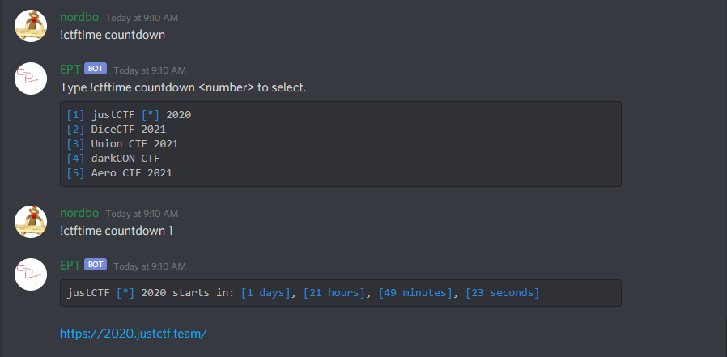

# bot

This bot is still work in process. It is a fork of [eptbot](https://github.com/ept-team/eptbot), which is again a fork of [igCTF](https://gitlab.com/inequationgroup/igCTF), which is again a fork of [NullCTF](https://github.com/NullPxl/NullCTF).

## Install

Configuration is done through environment variables. They can be defined in an `.env` file, or used directly, see [here](https://docs.docker.com/compose/environment-variables/) for more information.

The only required variable is `DISCORD_TOKEN`, the rest will use the default values as specified in the table below. See [`config.py`](./bot/config.py) for more information. 

| Name | Default | Comment |
| ---- | ------- | ------- |
| `DISCORD_TOKEN` |  | **Required!** Bot token, see [`config.py`](./bot/config.py) for more information |
| `MONGODB_URI` | `mongodb://mongo:27017` | URI for the MongoDB instance |
| `LOGGING_LEVEL` | `INFO` | The level of logging for alerting, etc. Uses the logging levels specified [here](https://docs.python.org/3/library/logging.html) |
| `LOGGING_FORMAT` | `%(asctime)s:%(levelname)s:%(name)s: %(message)s` | Logging format, see [here](https://docs.python.org/3/library/logging.html#formatter-objects) |
| `LOGGING_FILE` |  | If enabled, will send logging to this file |
| `LOGGING_DISCORD_LEVEL` | `ERROR` | The minimum level for logging into the logging channel (`CHANNEL_LOGGING_ID`) |
| `COMMAND_PREFIX` | `!` | Prefix for all the bot commands (i.e. `!done`) |
| `MAINTAINERS` |  | Comma-separated list with profile IDs of the bot maintainers, these users have permission to export and delete CTFs |
| `GUILD_IDS` |  | Comma-separated list with guild IDs of where the bot should run. Used for executing CTF channel cleanup manually |
| `CATEGORY_WORKING` | `working` | Category where channels for challenges that are currently being worked on during a CTF |
| `CATEGORY_DONE` | `done` | Category where channels for challenges that are marked as done during a CTF |
| `CATEGORY_ARCHIVE_PREFIX` | `archive` | Category to move channels to when the CTF is over. There is a max limit on 50 channels per category. The bot wil automatically move channels to new categories when needed |
| `CHANNEL_EXPORT` | `export` | The channel to upload exports to |
| `CHANNEL_LOGGING_ID` |  | If enabled, will send logging to this channel, based on the `LOGGING_DISCORD_LEVEL` logging level |
| `CTFTIME_TEAM_ID` |  | CTFtime ID for the `!ctftime team` command |
| `CTFTIME_TEAM_NAME` |  | CTFtime name for the `!ctftime team` command |

### start

`docker-compose up --build -d`

### develop

The `/bot` folder is mounted into the container, so you just need to restart to get your updated changes.
```bash
docker-compose build
docker-compose up # ctrl-c to stop and run up again to restart
```

### linting

This codebase uses the PEP 8 code style. We enforce this with isort, black & flake8. In addition to the standards outlined in PEP 8, we have a few guidelines (see setup.cfg for more info):

First build the tester Docker image
```
$ make build
```

Format the code with black & isort

```shell
$ make fixme
```

To check if it is formatted properly, run:

```shell
$ make check
```

A git `pre-commit` hook for automatically linting before comitting can be found in [git-hook](./git-hook), to install it:
```shell
$ cp git-hook .git/hooks/pre-commit
```

## How to Use

> The main use for fiskebot is to easily set up a CTF for your discord server to play as a team. The following commands listed are probably going to be used the most.

- `!help` Display the main help commands.

- `!create "ctf name"` This is the command you'll use when you want to begin a new CTF. This command will make a text channel with your supplied name. The bot will also send a message in chat where members can react to join the CTF.


- `!add <challenge name>` This will create a new channel for a given challenge.

- `!done [@users ...]` Mark a challenge as done. Needs to be done inside the challenge channel. Optionally specify other users who also contributed to solving the challenge, space separated without the @s.

- `!ctf archive` Mark the ctf as over and move it to the archive categories (specified in `/bot/config.py`).

---

> The following commands use the api from [ctftime](https://ctftime.org/api)

- `!ctftime countdown/timeleft` Countdown will return when a selected CTF starts, and timeleft will return when any currently running CTFs end in the form of days hours minutes and seconds.
    

- `!ctftime upcoming <number>` Uses the api mentioned to return an embed up to 5 upcoming CTFs. If no number is provided the default is 3.
    

- `!ctftime current` Displays any currently running CTFs in the same embed as previously mentioned.

- `!ctftime top <year>` Shows the ctftime leaderboards from a certain year _(dates back to 2011)_.
    

- `!ctftime team [team name/id]` Display the top 10 events a team have gotten points for this year.


> ### Have a feature request? Make a GitHub issue.
